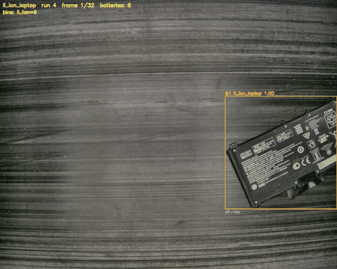

# batterycv

Computer-vision battery sorting for Prof. Bin Chen's DOE-funded recycling project
(Purdue Fort Wayne · UHV Technologies · Penn State). Conveyor-mounted camera →
**detect & track → read labels (OCR) → classify type** — the full loop is closed and runs
end-to-end with one command:

```bash
python scripts/run_pipeline.py --run-id 60    # any capture run → annotated video + per-battery manifest
```



*Boxes colored by predicted chemistry (orange = Li-ion, red = LiSO2, blue = Ni-Cd, green = Ni-MH),
with brand / part # under a battery when the OCR read one.*

## Results at a glance

| phase | what | headline (honest, held-out) | findings doc |
|---|---|---|---|
| 1a detect | YOLO11s, YOLO-World-bootstrapped + 36 hand-labeled frames | P 0.466 · R 0.446 · mAP50 0.252 — ceiling is the **imagery** (dark belt), not labels/architecture | `docs/recall_ceiling_findings.md` |
| 1b track | ByteTrack over timestamp-segmented runs | stable per-battery IDs, best-conf crop per battery; 103/103 runs → 698 batteries | — |
| 2 OCR | Qwen2.5-VL-3B on all 698 crops (classical OCR fails outright) | coverage ≠ accuracy: the VLM **prior-fills** chemistry/voltage/capacity — only brand (14%) + part # (15%) are trustworthy | `docs/ocr_findings.md` |
| 3 classify | yolo11n-cls on crops, run-grouped holdout | **6-way type acc 0.874 · 4-way chemistry acc 0.899** (majority baseline 0.603); OCR features add zero — sorting is visual, OCR is metadata | `docs/type_classifier_findings.md` |

**Demo videos for all 103 capture runs** (annotated sorting-line view, one zip per chemistry)
are on the [demo-videos-v1 release](https://github.com/fronkt/batterycv/releases/tag/demo-videos-v1),
with `results/demo/all_runs_summary.csv` indexing per-run battery counts and type agreement
(716/756 = 94.7% overall — includes training runs; the honest held-out numbers are the table above).
Note the demo tracker is **BoT-SORT**: ByteTrack's IoU association silently drops batteries whose
box (~160 px) is smaller than the belt's ~156 px/frame motion — ni_cd_small/ni_mh_all counted
10/12 batteries instead of 49/31 until BoT-SORT's motion compensation bridged the gap (which is
also why the demo counts 756 batteries vs. the 698-crop Phase-2 inventory; `tasks/lessons.md`).

The two project-level lessons worth carrying beyond this repo: (1) every phase hit the same
wall — dark, low-contrast imagery; the step-change lever is belt **lighting**, not more
labels/compute; (2) a VLM's field coverage is not accuracy — audit value *distributions*
against known truth before trusting any extracted field.

## Data
- Source: `OneDrive_1_3-7-2025.zip` (~10.7 GB), Basler acA1300-200uc, **1280×1024 color BMP**.
- 6 folders = weak, session-level **type labels**.
- ⚠️ The zip nests an exact duplicate of the laptop folder inside the mobile folder (366 files).
  `extract_data.py` auto-quarantines it. **True dataset = 2,493 distinct frames:**

| label | chemistry | form | frames |
|---|---|---|---|
| li_ion_mobile | Li-ion | mobile | 1099 |
| li_ion_laptop | Li-ion | laptop | 366 |
| ni_cd_bulk | Ni-Cd | bulk | 346 |
| liso2 | LiSO2 | cell | 273 |
| ni_cd_small | Ni-Cd | small | 248 |
| ni_mh_all | Ni-MH | mixed | 161 |

Frames are dark/low-contrast with many batteries scattered per frame → illumination is
normalized (CLAHE) before detection. No box/text ground truth exists; a small hand-verified
set (72 frames) gives the honest detection metrics, and type evaluation splits by *run* so
same-session near-duplicates never straddle train/test.

## Layout
```
scripts/   extract_data, build_manifest, eda, make_val_split, label_eval,
           pseudo_label_{sam,yoloworld}, train_detector, build_label_pool,
           label_assisted, finetune_detector, eval_detection,
           track, ocr_crops, train_type_classifier, run_pipeline
batterycv/ config, io (manifest/timestamps/runs), preprocess, detect_classical, viz
configs/   paths.yaml (all paths), yolo_battery.yaml
results/   phase2_ocr/ (698 OCR records), phase3_type/ (classifier metrics), demo/
docs/      per-phase findings (recall ceiling, OCR audit, type classifier)
vast/      setup.sh (GPU box)
tasks/     todo.md (full project log), lessons.md
```
Data, weights, and `runs/` live outside git (see `.gitignore`); paths in `configs/paths.yaml`.

## Reproduce
```bash
python -m venv .venv && .venv/Scripts/activate    # Windows
pip install -r requirements.txt

# data prep (local, CPU)
python scripts/extract_data.py && python scripts/build_manifest.py

# phase 1 — detector: bootstrap labels, train, hand-fix a small pool, fine-tune, eval honestly
python scripts/pseudo_label_yoloworld.py
python scripts/train_detector.py --model yolo11s.pt --epochs 80 --imgsz 1024
python scripts/build_label_pool.py && python scripts/label_assisted.py
python scripts/finetune_detector.py
python scripts/eval_detection.py --weights runs/detect/battery_ft1/weights/best.pt

# phase 1b + 2 — track every run, OCR the crops (GPU recommended for the VLM)
python scripts/track.py --list-runs        # then loop --run-id, or one run for a demo
python scripts/ocr_crops.py --engine qwen --device cuda --crops <crops> --out <out>

# phase 3 — type classifier (14 min on laptop CPU) + the end-to-end demo
python scripts/train_type_classifier.py
python scripts/run_pipeline.py
```
